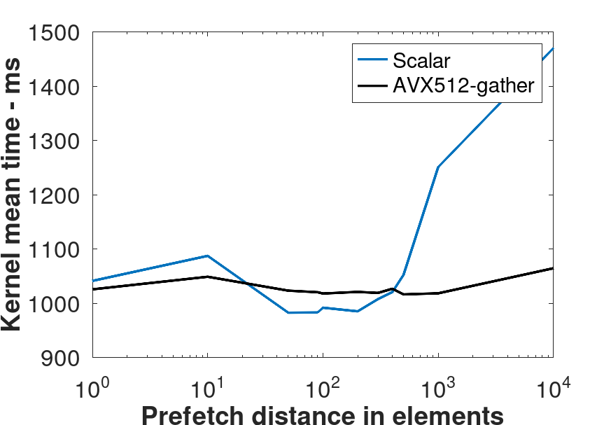

# Indirect Access Benchmark
Benchmarks memory access pattern representative of unstructured 
computational fluid dynamics solvers, where cell connectivity results
in indirect (gather) access to solution data. The assumption in this example
is that the unstructured mesh has not been reordered. These kernels are notoriously memory-latency bound.

## Kernels
There are 6 kernels in the benchmark:

**Sequential access**: Fastest kernel thanks to HW prefetcher and trivial simd vectorization (compiler)

**Sequential access through index dereference**: Second fastest kernel. Shows the cost of index indirection

**Scalar indirect access with shuffled indices**: Representative of how codes are typically written. 

**Shuffled indices + SW prefetching**: The prefetcher requests memory for a future iteration as the memory for the current iteration is incoming and about to be processed. Requires tuning of the prefetching distance.

**Shuffled indices with AVX512 explicit gather**: Forcing the compiler to use SIMD gather instructions at any optimization level

**AVX512 explicit gather + SW prefetching**: Adds SW prefetching to SIMD gather

## Results

The conclusions in this section are for an intel laptop (lscpu | grep -E "Model name|L1|L2|L3|Line size")


Model name:                              11th Gen Intel(R) Core(TM) i5-1145G7 @ 2.60GHz  
L1d cache:                               192 KiB (4 instances)  
L1i cache:                               128 KiB (4 instances)  
L2 cache:                                5 MiB (4 instances)  
L3 cache:                                8 MiB (1 instance)  


with 64 bytes cache line (getconf LEVEL1_DCACHE_LINESIZE). Only the kernels with the shuffled indices are representative of an unstructured CFD solver.

All the kernels are run by pinning to a thread (taskset -c 2 ./indirect_access) in both powersave and performance modes.

The nominally scalar loop (with shuffled indices) and the AVX512-gather loop perform essentially the same. This is because the clang21 compiler at O3 and march=native generated simd instructions for the nominally scalar loop very similar to the simd-gather kernel, as confirmed  by inspecting the asm ('-g -save-temps -fverbose-asm' --> main.s)

<table>
<tr>
<th>Scalar</th>
<th>SIMD-gather</th>
</tr>
<tr>
<td>

```assembly
.loc    1 64 71 is_stmt 1 # main.cpp:64:71
vpmovzxdq       -224(%r13,%r15,4), %zmm4 
vpmovzxdq       -192(%r13,%r15,4), %zmm5 
.loc    1 64 66 is_stmt 0 # main.cpp:64:66
kxnorw  %k0, %k0, %k1
vpxor   %xmm6, %xmm6, %xmm6
vpgatherqd      (%rbx,%zmm4,4), %ymm6 {%k1}
```

</td>
<td>

```assembly
.loc    1 118 20 # main.cpp:118:20
vpaddd  %zmm0, %zmm3, %zmm0
vpaddd  %zmm1, %zmm5, %zmm1
vpaddd  %zmm0, %zmm1, %zmm0
.loc    1 116 37 # main.cpp:116:37
vmovdqu64       1088(%r13,%r15,4), %zmm1
.loc    1 117 39 # main.cpp:117:39
vpxor   %xmm3, %xmm3, %xmm3
kxnorw  %k0, %k0, %k1
vpgatherdd      (%rbx,%zmm1,4), %zmm3 {%k1}
```

</td>
</tr>
</table>

SW prefetching results in a 40% uplift (wrt no prefetching) when the CPU is in powersave mode, but this uplift reduces to only 3% when the CPU is in performance mode (0.2% std dev). In powersave mode, the non-prefetched version operates at reduced frequency when waiting for memory, while the prefetced version keeps the CPU busy enough to operate at high frequency constantly (as confirmed with 'perf stat -e cycles,instructions ./indirect_access').
Additionally, SW prefetching is beneficial **only** for the the nominally scalar code. The simd-gather code + SW prefetching has approximately the same performance as the non-prefetched code, or worse. Looking at the asm for the nominally scalar and for the vectorized code both with SW prefetching, *the prefetching instructions prevent vectorization of the nominally-scalar code* (movl instead of vpmovzxdq and no more vpgatherqd), while the gather in the vectorized code requests all the memory it needs *in one instruction* (16 loads in one gather). AVX512 gather already provides enough memory-level parallelism that additional memory requests only saturate the memory bandwidht without adding any benefit likely resulting in decreased performance. Additionally, there should be one prefetch instruction for each simd lane, further exacerbating the issue.

<table>
<tr>
<th>Scalar + Prefetching</th>
<th>SIMD + Prefetching</th>
</tr>
<tr>
<td>

```assembly
	.loc	1 91 42 is_stmt 1 # main.cpp:91:42
	movl	-28(%rcx,%rdx,4), %esi
	.loc	1 91 11 is_stmt 0 # main.cpp:91:11
	prefetcht0	(%rbx,%rsi,4)
.Ltmp652:
	.loc	1 92 23 is_stmt 1 # main.cpp:92:23
	movl	-28(%rax,%rdx,4), %esi
.Ltmp653:
	.loc	1 92 15 is_stmt 0 # main.cpp:92:15
	addl	(%rbx,%rsi,4), %r13d
```

</td>
<td>

```assembly
	.loc	1 153 20                        # main.cpp:153:20
	vpaddd	%zmm5, %zmm2, %zmm1
	.loc	1 149 42                        # main.cpp:149:42
	movl	896(%rcx,%rax,4), %edx
	.loc	1 149 11 is_stmt 0              # main.cpp:149:11
	prefetcht0	(%r14,%rdx,4)
	.loc	1 151 37 is_stmt 1              # main.cpp:151:37
	vmovdqu64	896(%rcx,%rax,4), %zmm2
	.loc	1 152 39                        # main.cpp:152:39
	kxnorw	%k0, %k0, %k1
	vpxor	%xmm5, %xmm5, %xmm5
	vpgatherdd	(%rbx,%zmm2,4), %zmm5 {%k1}
```

</td>
</tr>
</table>



The prefetch distance is a knob that needs to be tuned to extract maximum performance. Ultimately, the optimal prefetch distance and the performance uplift will depend on the index distribution.

### Conclusions
This is a memory-bandwidth-bound problem. At least on the hardware mentioned above and with the clang-21 compiler, for this class of kernel, compiler auto vectorization issues instructions almost identical to the hand-vectorized code. The scalar loop with SW prefetching results in performance uplift over the hand-vectorized code. In this case, prefetching prevents auto-vectorization.