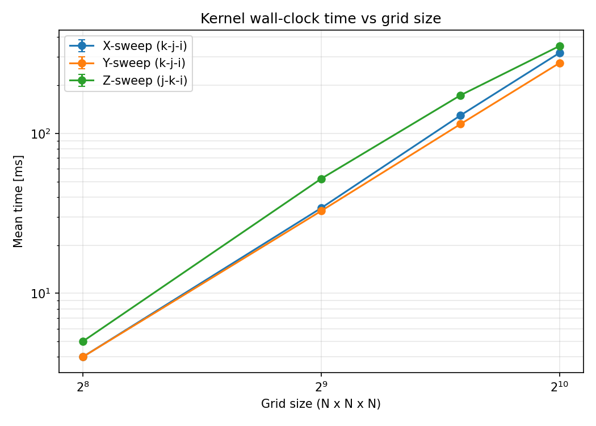

# Strided Access Benchmark
Benchmarks memory access pattern representative of structured, directionally-split,
WENO-based CFD solvers. While WENO schemes perform more FLOPs per memory
access and may benefit from hardware prefetching, 
the memory access pattern remains one of the primary determinants of the scheme's performance.
This benchmark focuses on the memory behavior by investigating effects like grid size, loop ordering, 
cache and TLB misses for a 3D grid. Perhaps with the exception of the loop where the stride-1 sweep 
and sweep direction align, the fastest loop ordering is not reliably predicted by common 
rules of thumb (contiguous-innermost or sweep-direction-innermost), and the optimal loop ordering 
depends on a complex interaction between compiler vectorization and cache reuse.

## Kernels
The benchmark investigates the performance of the X, Y and Z sweep of the 
directionally split 3D WENO scheme. Storage for the benchmark is provided by a mmap-backed
buffer wrapped in a RAII class. An object of this class satisfies the range interface
and allows for huge-page-backed allocation at run time. 
A std::mdspan with layout_left (column major) enbles
sweeping in the different directions. Additionally the cost of the mdspan abstraction
is compared to the cost of hand-rolled indexing for the sweep in the z direction.
To reduce the amount of loops to measure, we focus on loop orderings that we would expect to
see in production CFD codes or that appear to be memory friendly according to common
rules of thumb that can be found in perf optimization literature. Typically these either require the 
sweep direction be the innermost loop, or that the unit stride direction is the innermost loop.
Regardless of the innermost loop, little is said about the order of the other two loops. 
Because we are not measuring all the loop permutations, it's possible that we do not 
discover the global optimum.

### X sweep
For layout_left, a sweep in the X direction is a stride-1 sweep. For this sweep direction we 
test only two permutations of the loops. Both loops have the unit stride as the innermost loop, but
they differ in the order of the outer loops. The first loop we measure is the textbook loop
```C++
for k = ...
	for j = ...
		for i = ...
			sum += sol[i-2,j,k] + sol[i-1,j,k] + sol[i,j,k] + sol[i+1,j,k] + sol[i+2,j,k]
```
which is also expected to be the fastest loop of any sweep. We then measure the performance of
```C++
for j = ...
	for k = ...
		for i = ...
			sum += sol[i-2,j,k] + sol[i-1,j,k] + sol[i,j,k] + sol[i+1,j,k] + sol[i+2,j,k]
```
### Y sweep
For the sweep in the y direction we decided to investigate first the loop 
```C++
for k = ...
	for i = ...
		for j = ...
			sum += sol[i,j-2,k] + sol[i,j-1,k] + sol[i,j,k] + sol[i,j+1,k] + sol[i,j+2,k]
```
that follows the sweep-direction-innermost rule of thumb. We then investigate the loop
```C++
for i = ...
	for k = ...
		for j = ...
			sum += sol[i,j-2,k] + sol[i,j-1,k] + sol[i,j,k] + sol[i,j+1,k] + sol[i,j+2,k]
```
that could possibly represent the worst case for this sweep direction. We then look at having the
1-strided loop as the innermost loop with the sweep direction second innermost and finally the 
Z direction as the outermost loop 
```C++
for k = ...
	for j = ...
		for i = ...
			sum += sol[i,j-2,k] + sol[i,j-1,k] + sol[i,j,k] + sol[i,j+1,k] + sol[i,j+2,k]
```
And finally we keep the unit stride as the innermost loop and we invert the order of the outer loops
```C++
for j = ...
	for k = ...
		for i = ...
			sum += sol[i,j-2,k] + sol[i,j-1,k] + sol[i,j,k] + sol[i,j+1,k] + sol[i,j+2,k]
```
### Z sweep
For the sweep in the Z direction we use the data gathered from the study of the Y sweep and
we focus only on two loops. The first will have the sweep direction as the innermost loop and the 
other loops are chosen in a somewhat arbitrary fashion
```C++
for j = ...
	for i = ...
		for k = ...
			sum += sol[i,j,k-2] + sol[i,j,k-1] + sol[i,j,k] + sol[i,j,k+1] + sol[i,j,k+2]
```
Then we switch the order of the k and i loops from before so that the 1-strided loop is innermost 
followed by the sweep direction
```C++
for j = ...
	for k = ...
		for i = ...
			sum += sol[i,j,k-2] + sol[i,j,k-1] + sol[i,j,k] + sol[i,j,k+1] + sol[i,j,k+2]
```
Furthermore, for this last loop we also compare the performance of mdspan's operator[] with the
performance of direct indexing into linear memory.
## Results

The conclusions in this section are for an intel laptop (lscpu | grep -E "Model name|L1|L2|L3|Line size")


Model name:                              11th Gen Intel(R) Core(TM) i5-1145G7 @ 2.60GHz  
L1d cache:                               192 KiB (4 instances)  
L1i cache:                               128 KiB (4 instances)  
L2 cache:                                5 MiB (4 instances)  
L3 cache:                                8 MiB (1 instance)  


with 64 bytes cache line (getconf LEVEL1_DCACHE_LINESIZE).

The code is compiled with optimization level 3 (`O3`) and with `-march=native`
 in order to enable AVX512 instructions om the i5 processor.
All the kernels are run by pinning to a thread in performance mode
```
sudo cpupower frequency-set -g performance
taskset -c 2 ./strided_access
```
The mmap buffer can be backed by huge pages via `--Huge` at run time after reserving the pool
(N=1024 needs 4 GiB → 2048 pages)
```
sudo sysctl vm.nr_hugepages=2048     # verify HugePages_Total in /proc/meminfo
taskset -c 2 ./strided_access --Huge
sudo sysctl vm.nr_hugepages=0        # release afterward
```
When reported, the performance counters are collected
by running `perf stat` on the `strided_access` executable 
```
sudo taskset -c 2 perf stat -e dTLB-load-misses,dTLB-loads,L1-dcache-load-misses,LLC-load-misses,cycles,instructions,task-clock \
	./build/benchmarks/strided_access/strided_access
```
As a consequence the `perf stat` measures the performance of the `perf` library in
addition to the performance of the measured kernels. Hence, while the performance counters are
directionally correct, there can be some discrepancies between 
the counters and the measured wall-clock time. Future work will address these discrepancies.

Unless otherwise specified, the grid size is Nx=Ny=Nz=1024.


### X sweep
The asm code for the two loop ordering for the X sweep shows that in both cases the compiler 
emits identical AVX512 instructions for the inner loop.
<table>
<tr>
<th>X sweep -- k-j-i</th>
<th>X sweep -- j-k-i</th>
</tr>
<tr>
<td>

	vmovdqu	-100(%rdx,%r8,4), %ymm5
	vmovdqu	-68(%rdx,%r8,4), %ymm6
	vmovdqu	-36(%rdx,%r8,4), %ymm7
	valignd	$7, %ymm0, %ymm5, %ymm8         # ymm8 = ymm0[7],ymm5[0,1,2,3,4,5,6]
	vmovdqu	-4(%rdx,%r8,4), %ymm0
	.loc	1 126 38 is_stmt 0              # benchmarks/strided_access/main.cpp:126:38 
	vpaddd	%ymm1, %ymm8, %ymm1
	valignd	$7, %ymm5, %ymm6, %ymm8         # ymm8 = ymm5[7],ymm6[0,1,2,3,4,5,6]
	vpaddd	%ymm2, %ymm8, %ymm2
	valignd	$7, %ymm6, %ymm7, %ymm8         # ymm8 = ymm6[7],ymm7[0,1,2,3,4,5,6]
	vpaddd	%ymm3, %ymm8, %ymm3
	valignd	$7, %ymm7, %ymm0, %ymm8         # ymm8 = ymm7[7],ymm0[0,1,2,3,4,5,6]
	vpaddd	%ymm4, %ymm8, %ymm4
	.loc	1 126 58                        # benchmarks/strided_access/main.cpp:126:58 
	vpaddd	-112(%rdx,%r8,4), %ymm1, %ymm1
	vpaddd	-80(%rdx,%r8,4), %ymm2, %ymm2
	vpaddd	-48(%rdx,%r8,4), %ymm3, %ymm3
	vpaddd	-16(%rdx,%r8,4), %ymm4, %ymm4
	...

</td>
<td>

	vmovdqu	-100(%rdx,%r8,4), %ymm5
	vmovdqu	-68(%rdx,%r8,4), %ymm6
	vmovdqu	-36(%rdx,%r8,4), %ymm7
	valignd	$7, %ymm0, %ymm5, %ymm8         # ymm8 = ymm0[7],ymm5[0,1,2,3,4,5,6]
	vmovdqu	-4(%rdx,%r8,4), %ymm0
	.loc	1 146 38 is_stmt 0              # benchmarks/strided_access/main.cpp:146:38 
	vpaddd	%ymm1, %ymm8, %ymm1
	valignd	$7, %ymm5, %ymm6, %ymm8         # ymm8 = ymm5[7],ymm6[0,1,2,3,4,5,6]
	vpaddd	%ymm2, %ymm8, %ymm2
	valignd	$7, %ymm6, %ymm7, %ymm8         # ymm8 = ymm6[7],ymm7[0,1,2,3,4,5,6]
	vpaddd	%ymm3, %ymm8, %ymm3
	valignd	$7, %ymm7, %ymm0, %ymm8         # ymm8 = ymm7[7],ymm0[0,1,2,3,4,5,6]
	vpaddd	%ymm4, %ymm8, %ymm4
	.loc	1 146 58                        # benchmarks/strided_access/main.cpp:146:58 
	vpaddd	-112(%rdx,%r8,4), %ymm1, %ymm1
	vpaddd	-80(%rdx,%r8,4), %ymm2, %ymm2
	vpaddd	-48(%rdx,%r8,4), %ymm3, %ymm3
	vpaddd	-16(%rdx,%r8,4), %ymm4, %ymm4
	...

</td>
</tr>
</table>
However, the memory traffic between the two loops differs slightly

| Counter | k-j-i | j-k-i |
| --- | ---: | ---: |
| cycles | 29,537,541,360 (4.369 GHz) | 30,815,296,689 (4.372 GHz) |
| instructions (IPC) | 44,361,028,708 (1.50) | 44,320,020,463 (1.44) |
| dTLB-load-misses | 172,916 (0.00%) | 11,541,512 (0.06%) |
| dTLB-loads | 18,685,482,078 | 18,676,928,906 |
| L1-dcache-load-misses | 880,658,325 | 906,048,356 |
| LLC-load-misses | 19,360,651 | 36,683,612 |

The k-j-i loop has fewer TLB load misses and L1 cache misses so that the CPU can issue slightly more
instructions per cycle compared to the j-k-i loop. Practically, this means that the k-j-i loop is
approximately 25ms faster than the j-k-i with a 1% standard deviation in both cases. 

### Y sweep

The loop orderings for the Y sweep can be split into two families by their innermost loop. When the 4 KB-stride
sweep direction `j` is innermost the compiler emits slow gather instructions. On the other hand, the compiler 
emits contiguous AVX-512 loads when the unit-stride `i` loop is innermost. The asm code for the fastest kernel
of each family is shown in the table below.

<table>
<tr>
<th>Y sweep -- k-i-j</th>
<th>Y sweep -- k-j-i</th>
</tr>
<tr>
<td>

	# =>  This Loop Header: Depth=2
	#       Child Loop BB0_19 Depth 3
	#         Child Loop BB0_20 Depth 4
    movq    %rbx, %rax
    shlq    $10, %rax
    movabsq    $4503599627370494, %rdx         # imm = 0xFFFFFFFFFFFFE
    leaq    (%rax,%rdx), %rcx
    leaq    1(%rax,%rdx), %rdx
    orq    $2, %rax
    vpbroadcastq    %rcx, %ymm0
    vpsllq    $12, %ymm0, %ymm1
    vmovdqa    .LCPI0_17(%rip), %ymm7          # ymm7 = [4136960,4141056,4145152,4149248]
	.Ltmp213:
    .loc    74 53 110 is_stmt 1             # __mdspan/default_accessor.h:53:110 @[ main.cpp:166:20]
    vpaddq    %ymm7, %ymm1, %ymm2
    vmovdqu    %ymm2, 112(%rsp)                # 32-byte Spill
    vpbroadcastq    %rdx, %ymm2
    vpbroadcastq    %rbx, %ymm8

		...

	#     Parent Loop BB0_18 Depth=2
	# =>    This Loop Header: Depth=3
	#         Child Loop BB0_20 Depth 4
    leaq    (%r12,%rax,4), %rcx
    vmovd    %ebp, %xmm25
    vpxord    %xmm26, %xmm26, %xmm26
    movl    $1008, %edx                     # imm = 0x3F0
    vmovdqa64    .LCPI0_26(%rip), %ymm21 # ymm21 = [2,3,4,5]
    vmovdqa64    .LCPI0_25(%rip), %ymm22 # ymm22 = [6,7,8,9]
    vpbroadcastq    .LCPI0_27(%rip), %ymm9  # ymm9 = [8,8,8,8]
    vpbroadcastq    .LCPI0_28(%rip), %ymm10 # ymm10 = [16,16,16,16]

		...

	#     Parent Loop BB0_18 Depth=2
	#       Parent Loop BB0_19 Depth=3
	# =>      This Inner Loop Header: Depth=4
    vpaddq    %ymm9, %ymm21, %ymm23
    vpaddq    %ymm9, %ymm22, %ymm24
    vpaddq    %ymm22, %ymm0, %ymm1
    vpaddq    %ymm21, %ymm0, %ymm28
	.Ltmp218:
    .loc    74 53 110 is_stmt 1             # __mdspan/default_accessor.h @[ main.cpp:166:20 ]
    vpsllq    $12, %ymm28, %ymm28
    vpsllq    $12, %ymm1, %ymm1
	.Ltmp219:
	.loc	1 166 20                        # benchmarks/strided_access/main.cpp:166:20 
	kxnorw	%k0, %k0, %k1
	vpxord	%xmm29, %xmm29, %xmm29
	vpgatherqd	(%rcx,%ymm1), %xmm29 {%k1}
	kxnorw	%k0, %k0, %k1
	vpxor	%xmm1, %xmm1, %xmm1
	vpgatherqd	(%rcx,%ymm28), %xmm1 {%k1}

</td>
<td>

	# =>  This Loop Header: Depth=2
	#       Child Loop BB0_130 Depth 3
	#         Child Loop BB0_131 Depth 4
	movq	%rbx, %rcx
	shlq	$10, %rcx
	movabsq	$4503599627370494, %rax         # imm = 0xFFFFFFFFFFFFE
	.Ltmp707:
	.loc	1 224 9 is_stmt 1               # benchmarks/strided_access/main.cpp:224
	leaq	(%rcx,%rax), %rdx
	...
	movq	%r9, 112(%rsp)                  # 8-byte Spill
	movl	$2, %r10d
	.Ltmp708:
	.loc	1 0 9 is_stmt 0                 # :0:9
	.Ltmp709:
	.p2align	4
	.LBB0_130:                              # %iter.check850

	#     Parent Loop BB0_129 Depth=2
	# =>    This Loop Header: Depth=3
	#         Child Loop BB0_131 Depth 4
	leaq	(%rdx,%r10), %r11
	shlq	$12, %r11
	...
	vmovd	%ebp, %xmm0
	vxorpd	%xmm1, %xmm1, %xmm1
	movq	$-992, %rbp                     # imm = 0xFC20
	.Ltmp710:
	vpxor	%xmm2, %xmm2, %xmm2
	vpxor	%xmm3, %xmm3, %xmm3
	.Ltmp711:
	.p2align	4
	.LBB0_131:                              # %vector.body853
	#     Parent Loop BB0_129 Depth=2
	#       Parent Loop BB0_130 Depth=3
	# =>      This Inner Loop Header: Depth=4
		.loc	1 226 38 is_stmt 1              # benchmarks/strided_access/main.cpp:226
	vpaddd	-12512(%r9,%rbp,4), %ymm0, %ymm0   # j-2
	vpaddd	-12480(%r9,%rbp,4), %ymm1, %ymm1
	vpaddd	-12448(%r9,%rbp,4), %ymm2, %ymm2
	vpaddd	-12416(%r9,%rbp,4), %ymm3, %ymm3
	.loc	1 226 58 is_stmt 0              # benchmarks/strided_access/main.cpp:226
	vpaddd	-8416(%r9,%rbp,4), %ymm0, %ymm0    # j-1

	...

	.loc	1 226 74                        # benchmarks/strided_access/main.cpp:226
	vpaddd	-4320(%r9,%rbp,4), %ymm0, %ymm0    # j
	
	...

	.loc	1 226 94                        # benchmarks/strided_access/main.cpp:226
	vpaddd	-224(%r9,%rbp,4), %ymm0, %ymm0     # j+1
	
	...

	.loc	1 226 17                        # benchmarks/strided_access/main.cpp:226 
	vpaddd	3872(%r9,%rbp,4), %ymm0, %ymm0     # j+2
	...

	jne	.LBB0_131
	.Ltmp712:
	# %bb.132:                              # %vec.epilog.vector.body889
                                        #   in Loop: Header=BB0_130 Depth=3
	.loc	1 225 11 is_stmt 1              # benchmarks/strided_access/main.cpp:225:11 
	vpaddd	%ymm0, %ymm1, %ymm0
	vpaddd	%ymm2, %ymm3, %ymm1
	vpaddd	%ymm0, %ymm1, %ymm0

	...
	
</td>
</tr>
</table>

Focusing on the innermost loop, the `k-i-j` loop ordering gathers values Nx elements apart
```C++
vmovdqa64    .LCPI0_25(%rip), %ymm22 # ymm22 = [6,7,8,9] //4 consecutive elements
...
vpaddq    %ymm22, %ymm0, %ymm1 // add base elements ymm0 and store in ymm1
...
vpsllq    $12, %ymm1, %ymm1 // <<12 bits = ×4096 B = Nx·4
...
vpgatherqd	(%rcx,%ymm1), %xmm29 {%k1} //gather
```
On the other hand the `k-j-i` loop ordering tracks 5 sequential memory streams (one for each point in the WENO 
scheme) 4 KB apart. Within each stream, memory access is contiguous and the compiler emits 4 `vpaddd` instructions
(the 4 unrolled accumulators) to perform the vectorized accumulation along the `i` direction within each stream.

```C++
vpaddd	-12512(%r9,%rbp,4), %ymm0, %ymm0   // j-2
...
vpaddd	-8416(%r9,%rbp,4), %ymm0, %ymm0    // j-1
...
vpaddd	-4320(%r9,%rbp,4), %ymm0, %ymm0    // j
...
vpaddd	-224(%r9,%rbp,4), %ymm0, %ymm0     // j+1
...
vpaddd	3872(%r9,%rbp,4), %ymm0, %ymm0     // j+2
```

While not shown, the other loop ordering in each family has the same asm for the inner loop, but suffers 
from worse memory access/reuse. This results in wildly different performance between the two loops in each family
as reported in the performance counters below (`perf stat -e dTLB-load-misses,dTLB-loads,L1-dcache-load-misses,LLC-load-misses,cycles,instructions,task-clock`)

**Gather-inner family** (`j` innermost, `vpgatherqd`):

| Counter | k-i-j | i-k-j |
| --- | ---: | ---: |
| cycles (freq) | 172,012,058,044 (4.374 GHz) | 501,273,609,157 (4.376 GHz) |
| instructions (IPC) | 123,333,741,332 (0.72) | 124,138,131,747 (0.25) |
| dTLB-load-misses | 12,858,880 (0.05%) | 11,754,400,991 (42.64%) |
| dTLB-loads | 27,407,508,640 | 27,563,748,055 |
| L1-dcache-load-misses | 15,173,488,707 | 13,784,347,535 |
| LLC-load-misses | 838,097,720 | 11,493,452,229 |

As mentioned, the inner-loop asm of these two kernels is identical (20 vpgatherqd/kxnorw each). The outer
loops differ slightly with some register spilling in one case, so that the instruction count differs
approximately by 0.6%. However, while the `k-i-j` has only 0.05% page misses, the `i-k-j` loop has ~43% page misses
because of the 4MB-stride `k` loop, so that the latter kernel has significantly degraded performance (~3x)
despite slightly better L1 cache misses.

**Contiguous-inner family** (unit-stride `i` innermost, `vmovdqu` loads):

| Counter | k-j-i | j-k-i |
| --- | ---: | ---: |
| cycles | 27,496,173,884 (4.374 GHz) | 64,452,829,950 (4.371 GHz) |
| instructions (IPC) | 39,645,899,892 (1.44) | 39,745,631,986 (0.62) |
| dTLB-load-misses | 224,210 (0.00%) | 58,082,297 (0.29%) |
| dTLB-loads | 20,098,557,124 | 20,126,463,341 |
| L1-dcache-load-misses | 883,698,724 | 3,845,591,375 |
| LLC-load-misses | 244,216,927 | 735,729,570 |

Once again, the inner-most loops of these two kernels have identical instructions (20 vpadds each),
but the `j-k-i` loop has worse memory reuse compared to the `k-j-i` loop, as confirmed by both L1 
and page misses. The `k-j-i` kernel at every j iteration *drops* one memory stream but reuses the other 4 because
at this grid size and on this CPU the streams can remain in L1/L2 cache.
The `j-k-i` kernel has the same asm for the innermost loop, so the 5 memory streams are still separated by 4*Nx bytes,
but k is the second innermost loop, so that at every k iteration each memory stream needs to jump `Nx*Ny*4` bytes
away resulting in little to none cache reuse.

**X-sweep/Y-sweep k-j-i kernel comparison**
Here we compare the performance of the `k-j-i` kernel for both the X and the Y sweep. Regardless of the resolution
the `k-j-i` kernel for the X-sweep is expected to be the fastest kernel, however measurements show that 
the same kernel for the Y-sweep is actually faster by about 12% (~15 standard deviations). 

| Counter | X-sweep | Y-sweep |
| --- | ---: | ---: |
| cycles | 29,537,541,360 (4.369 GHz) | 27,496,173,884 (4.374 GHz) |
| instructions (IPC) | 44,361,028,708 (1.50) | 39,645,899,892 (1.44) |
| LLC-load-misses | 19,360,651 | 244,216,927 |

Despite having worse memory reuse (LLC-load misses), the Y-sweep is faster than the X-sweep because of 
the smaller number of instructions issued (~5B). This happens because in the X-sweep the compiler
emits a `valignd	$7, %ymm0, %ymm5, %ymm8` (concatenate+shift ymm0 and ymm5 and write into ymm8) 
to build the consecutive SIMD vectors `i-2`, `i-1` ... `i+2`
in the WENO stencil. On the other hand, in the Y-sweep the compiler tracks 5 independent memory streams and sums along
these memory streams without any `valignd`.

### Z sweep
For the Z sweep we considered only two loop orderings, `j-i-k` and `j-k-i`. The asm for these two kernels is listed
in the table below

<table>
<tr>
<th>Z sweep -- j-i-k</th>
<th>Z sweep -- j-k-i</th>
</tr>
<tr>
<td>

	# =>  This Loop Header: Depth=2
	#       Child Loop BB0_19 Depth 3
	#         Child Loop BB0_20 Depth 4
	movq	%r14, %rax
	shlq	$12, %rax
	movl	$2, %ecx
	.Ltmp185:
	.p2align	4
	.LBB0_19:                               # %iter.check
	#     Parent Loop BB0_18 Depth=2
	# =>    This Loop Header: Depth=3
	#         Child Loop BB0_20 Depth 4
	.loc	1 245 11 is_stmt 1              # benchmarks/strided_access/main.cpp:245:11
	leaq	(%r15,%rcx,4), %rdx
	addq	%rax, %rdx
	vmovd	%ebx, %xmm2
	vpxor	%xmm3, %xmm3, %xmm3
	movl	$1008, %esi                     # imm = 0x3F0
	vmovdqa	.LCPI0_18(%rip), %ymm0          # ymm0 = [2,3,4,5]
	vmovdqa	.LCPI0_17(%rip), %ymm1          # ymm1 = [6,7,8,9]
	vpbroadcastq	.LCPI0_19(%rip), %ymm17 # ymm17 = [16,16,16,16]

	...

	#     Parent Loop BB0_18 Depth=2
	#       Parent Loop BB0_19 Depth=3
	# =>      This Inner Loop Header: Depth=4
	vpsllq	$22, %ymm0, %ymm4
	vpsllq	$22, %ymm1, %ymm5
	kxnorw	%k0, %k0, %k1
	vpxor	%xmm6, %xmm6, %xmm6
	vpgatherqd	-8388608(%rdx,%ymm5), %xmm6 {%k1}

	...

	kxnorw	%k0, %k0, %k1
	vpxor	%xmm8, %xmm8, %xmm8
	vpgatherqd	25165824(%rdx,%ymm5), %xmm8 {%k1}

	...

	
	vpaddd	%ymm4, %ymm6, %ymm4
	vpaddd	%ymm4, %ymm3, %ymm3
	vpaddq	%ymm17, %ymm0, %ymm0
	vpaddq	%ymm17, %ymm1, %ymm1
	addq	$-16, %rsi

	...

</td>
<td>

	# =>  This Loop Header: Depth=2
	#       Child Loop BB0_57 Depth 3
	#         Child Loop BB0_58 Depth 4
	movq	%rbx, %rcx
	shlq	$12, %rcx
	.Ltmp324:
	.loc	1 264 9 is_stmt 1               # benchmarks/strided_access/main.cpp:264:9 
	addq	%r15, %rcx
	movq	%rax, %rdx
	movl	$2, %esi
	.Ltmp325:
	.loc	1 0 9 is_stmt 0                 # :0:9
	.Ltmp326:
	.p2align	4
	.LBB0_57:
	#     Parent Loop BB0_56 Depth=2
	# =>    This Loop Header: Depth=3
	#         Child Loop BB0_58 Depth 4
	movq	%rsi, %rdi
	shlq	$22, %rdi
	incq	%rsi
	.Ltmp327:
	movq	%rsi, %r8
	shlq	$22, %r8
	vmovd	%r14d, %xmm0
	vpxor	%xmm1, %xmm1, %xmm1
	xorl	%r9d, %r9d
	vpxor	%xmm2, %xmm2, %xmm2
	vpxor	%xmm3, %xmm3, %xmm3
	.Ltmp328:
	.p2align	4
	.LBB0_58:  
	#     Parent Loop BB0_56 Depth=2
	#       Parent Loop BB0_57 Depth=3
	# =>      This Inner Loop Header: Depth=4

	.loc	1 266 38 is_stmt 1              # benchmarks/strided_access/main.cpp:266:38
	vpaddd	-16777312(%rdx,%r9,4), %ymm0, %ymm0
	vpaddd	-16777280(%rdx,%r9,4), %ymm1, %ymm1			# k-2
	vpaddd	-16777248(%rdx,%r9,4), %ymm2, %ymm2
	vpaddd	-16777216(%rdx,%r9,4), %ymm3, %ymm3
	.loc	1 266 58 is_stmt 0              
	vpaddd	-12583008(%rdx,%r9,4), %ymm0, %ymm0
	vpaddd	-12582976(%rdx,%r9,4), %ymm1, %ymm1			# k-1
	vpaddd	-12582944(%rdx,%r9,4), %ymm2, %ymm2
	vpaddd	-12582912(%rdx,%r9,4), %ymm3, %ymm3
	.loc	1 266 74                       
	vpaddd	-8388704(%rdx,%r9,4), %ymm0, %ymm0
	vpaddd	-8388672(%rdx,%r9,4), %ymm1, %ymm1			# k
	vpaddd	-8388640(%rdx,%r9,4), %ymm2, %ymm2
	vpaddd	-8388608(%rdx,%r9,4), %ymm3, %ymm3
	.loc	1 266 94                        
	vpaddd	-4194400(%rdx,%r9,4), %ymm0, %ymm0
	vpaddd	-4194368(%rdx,%r9,4), %ymm1, %ymm1			# k+1
	vpaddd	-4194336(%rdx,%r9,4), %ymm2, %ymm2
	vpaddd	-4194304(%rdx,%r9,4), %ymm3, %ymm3
	.loc	1 266 17                       
	vpaddd	-96(%rdx,%r9,4), %ymm0, %ymm0
	vpaddd	-64(%rdx,%r9,4), %ymm1, %ymm1			# k+2
	vpaddd	-32(%rdx,%r9,4), %ymm2, %ymm2
	vpaddd	(%rdx,%r9,4), %ymm3, %ymm3
	addq	$32, %r9
	cmpq	$992, %r9                       # imm = 0x3E0
	jne	.LBB0_58
	
</td>
</tr>
</table>

Similar to the asm for the Y sweep, for the `j-i-k` kernel the compiler emits slow `vpgatherqd` instructions.
On the other hand the `j-k-i` loop ordering tracks 5 sequential memory streams (one for each point in the WENO 
scheme in the Z direction) 4MB apart. 
Within each stream, memory access is contiguous and the compiler emits 4 `vpaddd` instructions
(the 4 unrolled accumulators) to perform the vectorized accumulation along the `i` direction within each stream.
For every `k` iteration, the compiler drops one memory stream (`k-2`) to load a new one 
(what was `k+3` at the previous iteration) reusing the other 4 memory streams (each stream 4Kb in size).
This results in a drastic performance difference (40x of mean wall-clock time) 
between the two kernels, as confirmed by the performance counters
in the table below

| Counter | j-i-k | j-k-i |
| --- | ---: | ---: |
| cycles (freq) | 627,011,849,372 (4.369 GHz) | 31,314,795,895 (4.359 GHz) |
| instructions (IPC) | 95,120,738,746 (0.15) | 39,869,904,891 (1.27) |
| dTLB-load-misses | 11,520,687,034 (41.80%) | 11,565,958 (0.06%) |
| dTLB-loads | 27,560,951,278 | 20,088,723,548 |
| L1-dcache-load-misses | 31,381,468,845 | 918,877,798 |
| LLC-load-misses | 4,511,912,580 | 224,639,776 |

#### std::mdspan zero-cost evaluation
In this section we compare the performance of `std::mdspan` to a hand-rolled field indexing approach
for the Z-sweep `j-k-i` kernel. The asm for the two outermost loop differ slightly between the two 
approaches (not shown), but the innermost loops (the contiguous `i` loops) have essentially the same asm

<table>
<tr>
<th>std::mdspan</th>
<th>Hand rolled</th>
</tr>
<tr>
<td>

	# =>  This Loop Header: Depth=2
	#       Child Loop BB0_57 Depth 3
	#         Child Loop BB0_58 Depth 4
	movq	%rbx, %rcx
	shlq	$12, %rcx
	.Ltmp324:
	.loc	1 264 9 is_stmt 1               # benchmarks/strided_access/main.cpp:264:9 
	addq	%r15, %rcx
	movq	%rax, %rdx
	movl	$2, %esi
	.Ltmp325:
	.loc	1 0 9 is_stmt 0                 # :0:9
	.Ltmp326:
	.p2align	4
	.LBB0_57:
	#     Parent Loop BB0_56 Depth=2
	# =>    This Loop Header: Depth=3
	#         Child Loop BB0_58 Depth 4
	movq	%rsi, %rdi
	shlq	$22, %rdi
	incq	%rsi
	.Ltmp327:
	movq	%rsi, %r8
	shlq	$22, %r8
	vmovd	%r14d, %xmm0
	vpxor	%xmm1, %xmm1, %xmm1
	xorl	%r9d, %r9d
	vpxor	%xmm2, %xmm2, %xmm2
	vpxor	%xmm3, %xmm3, %xmm3
	.Ltmp328:
	.p2align	4
	.LBB0_58:  
	#     Parent Loop BB0_56 Depth=2
	#       Parent Loop BB0_57 Depth=3
	# =>      This Inner Loop Header: Depth=4

	.loc	1 266 38 is_stmt 1              # benchmarks/strided_access/main.cpp:266:38
	vpaddd	-16777312(%rdx,%r9,4), %ymm0, %ymm0
	vpaddd	-16777280(%rdx,%r9,4), %ymm1, %ymm1			# k-2
	vpaddd	-16777248(%rdx,%r9,4), %ymm2, %ymm2
	vpaddd	-16777216(%rdx,%r9,4), %ymm3, %ymm3
	.loc	1 266 58 is_stmt 0              
	vpaddd	-12583008(%rdx,%r9,4), %ymm0, %ymm0
	vpaddd	-12582976(%rdx,%r9,4), %ymm1, %ymm1			# k-1
	vpaddd	-12582944(%rdx,%r9,4), %ymm2, %ymm2
	vpaddd	-12582912(%rdx,%r9,4), %ymm3, %ymm3
	.loc	1 266 74                       
	vpaddd	-8388704(%rdx,%r9,4), %ymm0, %ymm0
	vpaddd	-8388672(%rdx,%r9,4), %ymm1, %ymm1			# k
	vpaddd	-8388640(%rdx,%r9,4), %ymm2, %ymm2
	vpaddd	-8388608(%rdx,%r9,4), %ymm3, %ymm3
	.loc	1 266 94                        
	vpaddd	-4194400(%rdx,%r9,4), %ymm0, %ymm0
	vpaddd	-4194368(%rdx,%r9,4), %ymm1, %ymm1			# k+1
	vpaddd	-4194336(%rdx,%r9,4), %ymm2, %ymm2
	vpaddd	-4194304(%rdx,%r9,4), %ymm3, %ymm3
	.loc	1 266 17                       
	vpaddd	-96(%rdx,%r9,4), %ymm0, %ymm0
	vpaddd	-64(%rdx,%r9,4), %ymm1, %ymm1			# k+2
	vpaddd	-32(%rdx,%r9,4), %ymm2, %ymm2
	vpaddd	(%rdx,%r9,4), %ymm3, %ymm3
	addq	$32, %r9
	cmpq	$992, %r9                       # imm = 0x3E0
	jne	.LBB0_58

	...

</td>
<td>

	# =>  This Loop Header: Depth=2
	#       Child Loop BB0_19 Depth 3
	#         Child Loop BB0_20 Depth 4
	leaq	994(%rcx), %rdx
	leaq	998(%rcx), %rsi
	leaq	1002(%rcx), %rdi
	leaq	1006(%rcx), %r8
	leaq	1010(%rcx), %r9
	leaq	1014(%rcx), %r10
	orq	$1018, %rcx                     # imm = 0x3FA
	movq	%r11, 32(%rsp)                  # 8-byte Spill
	movl	$2, %r13d
	.Ltmp120:
	.loc	1 0 23 is_stmt 0                # :0:23
	.Ltmp121:
	.p2align	4
	.LBB0_19:                               # %iter.check
	#     Parent Loop BB0_18 Depth=2
	# =>    This Loop Header: Depth=3
	#         Child Loop BB0_20 Depth 4
	.loc	1 284 12 is_stmt 1              # benchmarks/strided_access/main.cpp:284:12
	movq	%r13, %rbp
	shlq	$22, %rbp
	addq	%r12, %rbp
	vpxor	%xmm0, %xmm0, %xmm0
	xorl	%eax, %eax
	vpxor	%xmm1, %xmm1, %xmm1
	vpxor	%xmm2, %xmm2, %xmm2
	vpxor	%xmm3, %xmm3, %xmm3
	.Ltmp122:
	.loc	1 0 12 is_stmt 0                # :0:12
	.Ltmp123:
	.p2align	4
	#     Parent Loop BB0_18 Depth=2
	#       Parent Loop BB0_19 Depth=3
	# =>      This Inner Loop Header: Depth=4
	.loc	1 285 54 is_stmt 1              # benchmarks/strided_access/main.cpp:285:54
	vpaddd	-16777312(%r11,%rax,4), %ymm0, %ymm0
	vpaddd	-16777280(%r11,%rax,4), %ymm1, %ymm1
	vpaddd	-16777248(%r11,%rax,4), %ymm2, %ymm2
	vpaddd	-16777216(%r11,%rax,4), %ymm3, %ymm3
	.loc	1 285 94 is_stmt 0              # benchmarks/strided_access/main.cpp:285:94
	vpaddd	-12583008(%r11,%rax,4), %ymm0, %ymm0
	vpaddd	-12582976(%r11,%rax,4), %ymm1, %ymm1
	vpaddd	-12582944(%r11,%rax,4), %ymm2, %ymm2
	vpaddd	-12582912(%r11,%rax,4), %ymm3, %ymm3
	.loc	1 285 130                       # benchmarks/strided_access/main.cpp:285:130
	vpaddd	-8388704(%r11,%rax,4), %ymm0, %ymm0
	vpaddd	-8388672(%r11,%rax,4), %ymm1, %ymm1
	vpaddd	-8388640(%r11,%rax,4), %ymm2, %ymm2
	vpaddd	-8388608(%r11,%rax,4), %ymm3, %ymm3
	.loc	1 286 49 is_stmt 1              # benchmarks/strided_access/main.cpp:286:49
	vpaddd	-4194400(%r11,%rax,4), %ymm0, %ymm0
	vpaddd	-4194368(%r11,%rax,4), %ymm1, %ymm1
	vpaddd	-4194336(%r11,%rax,4), %ymm2, %ymm2
	vpaddd	-4194304(%r11,%rax,4), %ymm3, %ymm3
	.loc	1 285 13                        # benchmarks/strided_access/main.cpp:285:13
	vpaddd	-96(%r11,%rax,4), %ymm0, %ymm0
	vpaddd	-64(%r11,%rax,4), %ymm1, %ymm1
	vpaddd	-32(%r11,%rax,4), %ymm2, %ymm2
	vpaddd	(%r11,%rax,4), %ymm3, %ymm3
	addq	$32, %rax
	cmpq	$992, %rax                      # imm = 0x3E0
	jne	.LBB0_20

	...
	
</td>
</tr>
</table>

so that the performance of the two kernels is essentially identical (within 5ms of mean wall-clock time),
as confirmed by the performance counters. 

| Counter | std::mdspan | hand-rolled |
| --- | ---: | ---: |
| cycles (freq) | 31,314,795,895 (4.359 GHz) | 31,500,320,210 (4.376 GHz) |
| instructions (IPC) | 39,869,904,891 (1.27) | 39,789,239,304 (1.26) |
| dTLB-load-misses | 11,565,958 (0.06%) | 11,590,469 (0.06%) |
| dTLB-loads | 20,088,723,548 | 20,080,317,169 |
| L1-dcache-load-misses | 918,877,798 | 926,315,701 |
| LLC-load-misses | 224,639,776 | 241,167,962 |

While we performed the comparison on only one kernel,
the experiment essentially confirms the zero cost of the `std::mdspan` abstraction, at least for the `layout_left`
tested in this work.

### Grid size sensitivity
In this section we investigate the performance of the fastest loop ordering for each sweep direction
 (as determined from the asm listings above) as a function of grid size. 

Because at low grid sizes (N<=256) the grids fits almost entirely in L1-L3 cache, at the time
of this writing the `perf` librariy does not have enough temporal resolution 
to accurately measure the performance of the different kernels. For bigger grids (N > 256) the
perforamance of the kernels is linear in the number of grid points. The Z sweep has the worse performance 
of the 3 kernels. This is because every time a memory stream is phased out, the next one has to be
fetched from memory that is 4 Mb away. The X and Y sweeps initially have almost identical performance
but the perforance of the X sweep degrades slightly for bigger grids so that at the biggest 
grid size tested 
(N = 1024) the Y sweep is actually faster than the X sweep. Repeating the grid sensitivity study
with huge-pages-backed memory (`--Huge`) did not significantly change ths result, confirming that 
the X-vs-Y comparison is not TLB-bound.

### Conclusions
In this work we investigated the performance of different computational kernels representative of
directionally-split, 5-point WENO schemes. By studying the asm code of the different kernels, we
demonstrated how their performance heavily depends on their memory access pattern 
(cache, TLB reuse). However, for memory efficient loops, vectorization and instruction overhead 
are again relevant.
Future work will focus on improving
the performance of the `X-sweep k-j-i` scheme by performing 5 unaligned loads at every `i` iteration,
on exploring tiled memory-access approaches and 
on improving the `perf` library via increased temporal resolution and direct gethering of 
the performance counters.